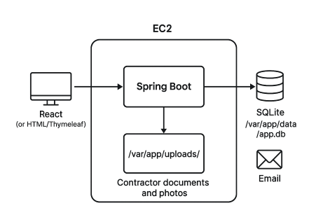

## System Architecture and Implementation Plan

### 1. Architecture Overview

Frontend: React (or plain HTML) interface for associates to manage contractors and claims.

Backend: Spring Boot REST API (Java) running on a single Amazon EC2 instance.

Storage:
  - SQLite database stored as a single file on the EC2 instance (e.g., /var/app/data/app.db) for contractor and claim data.
  - Local file system (e.g., /var/app/uploads/) for storing contractor documents and photos.

Authentication: Basic authentication managed by Spring Security (no external identity provider).

Notifications: Email notifications sent using Spring Mail with SMTP (e.g., Gmail, AWS SES SMTP endpoint, or a local mail server).

Deployment:
  - Spring Boot packaged as a JAR and run as a systemd service on EC2.
  - Nginx (optional) configured as a reverse proxy with HTTPS.

Monitoring & Logging:
  - application logs stored locally (/var/log/app.log).
  - basic EC2 monitoring through AWS CloudWatch agent.

Backup: Periodic backup of the SQLite file and uploads folder.

### 2. Core Modules

#### A. Contractor Management Module

Purpose: Maintain contractor profiles and service coverage.

Features:
  - Add, edit, deactivate contractors.
  - Track coverage areas (zip codes).
  - Upload and view related documents.

Database Notes:
  - SQLite stores all contractor and claim data in a single file.
  - No separate DB server is required.
  - Easy to backup by simply copying the .db file.

#### B. Claim Management Module

Purpose: Manage contractor claims.

Features:
  - Add, edit, and close claims.
  - Attach related documents or images.
  - Query claims by contractor or status.

Database Notes:
  - Stored in the same SQLite file.
  - Supports standard SQL queries